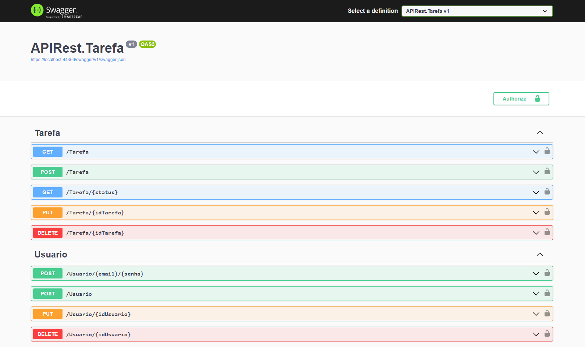

<br />
<p align="center">

<h1 align="center">
    <p style="color:#C03028">API Rest Tarefas</p>
</h1>



## 🧪 Tecnologias

Esse projeto foi desenvolvido com as seguintes tecnologias:

- [Swagger](https://swagger.io/)
- [Entity Framework Core](https://learn.microsoft.com/pt-br/ef/core/)
- [JWT](https://jwt.io/)

## 🚀 Como executar

Clone o projeto e acesse a pasta do mesmo.

```bash
$ git clone https://github.com/zdog10127/APIRest
$ cd APIRest
```

O app estará disponível no seu browser pelo endereço https://localhost:44356.

## 💻 Projeto

Criação de uma APIRest que permitirá aos usuários gerenciar uma lista de tarefas onde apenas os usuarios que criaram as tarefas podem atualizar e deletar as tarefas.

## 📝 License

Esse projeto está sob a licença MIT. Veja o arquivo [LICENSE](LICENSE.md) para mais detalhes.
